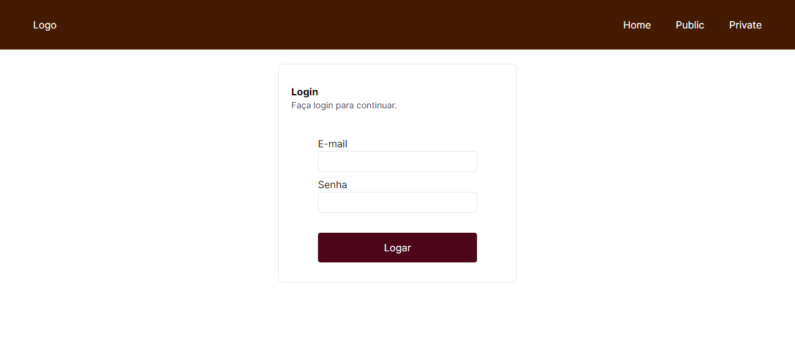
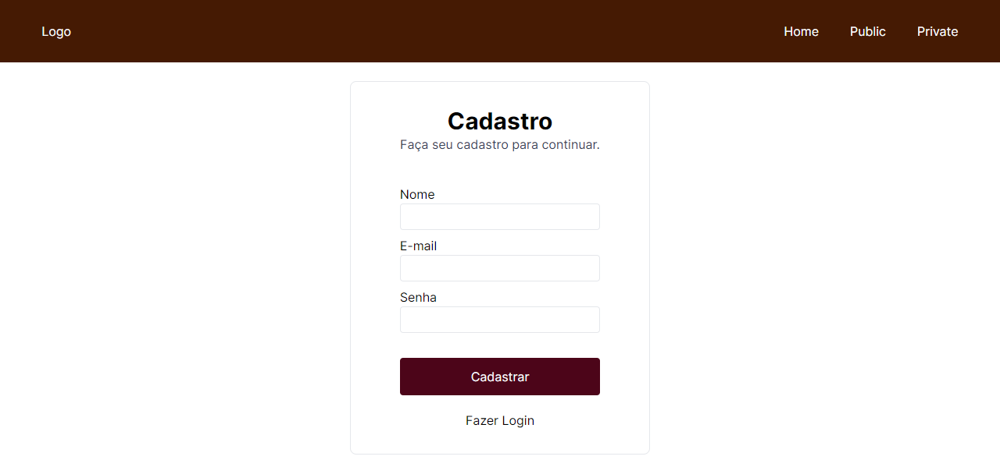
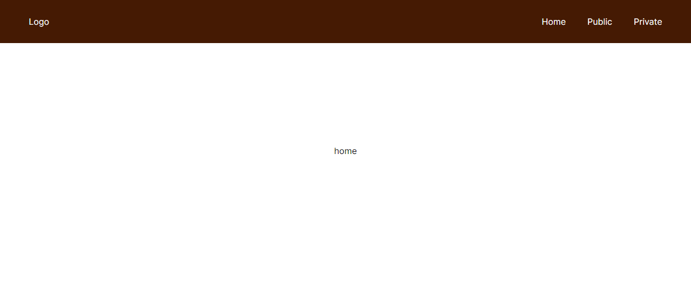

# Next-Auth-Project

Esse é mais projeto utilizando NextJS. Dessa vez utilizando uma lib muito útil, o Next-Auth. Acredito que uma das grandes utilizades dessa lib é a eficiência e praticidade.

Também utilizei Tailwind mais uma vez, estou dando essa chance para conhecer essa lib. E também investi no TypeScript, que ele sim creio ser muito importante.
## Aprendizados

- Trabalhar com a biblioteca Next-Auth;
- Fazer login utilizando email e senha;
- Fazer telas personalizadas de login;
- Criar rotas utilizando Next-Router e Next-Auth.

## Uso/Exemplos

### Routes

As rotas do NextJS são baseadas no React-Router-DOM, porém um pouco mais enrigecidas, por ser um framework, por ser um tanto complicado eu explicar a arquitetura completa das rotas apenas com trechos de código, deixo abaixo o link da documentação:

https://nextjs.org/docs/app/building-your-application/routing

### Next-Auth

Acredito que a explicação da arquitetura do Next-Auth e de seu código seja uma explicação muito extensa para colocar aqui, então igual no caso anterior, deixo a documentação da lib, na qual li para entender melhor:

https://next-auth.js.org/getting-started/example

## Screenshots

### Login

##### Login

#### Login - Invalid Credentials

### Cadastro

### Home 

#### Home

### Public

#### No User

#### Commum User 

#### Admin User 

#### New Created User

### Private

#### No User

#### Admin User 

## Autores

- [@Victor-Lis](https://github.com/Victor-Lis)

